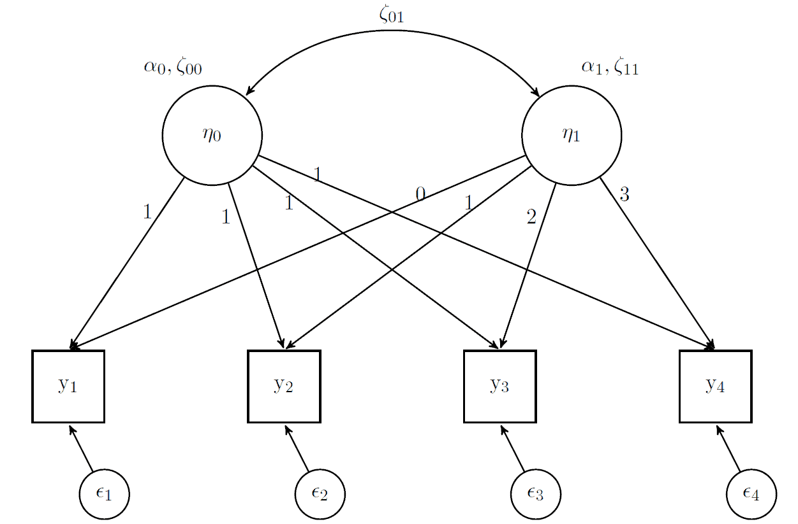

# Curve di crescita latente 

```{r, include = FALSE}
source("_common.R")
library("lavaan")
library("semPlot")
library("knitr")
library("markdown")
library("patchwork")
library("DT")
library("kableExtra")
library("lme4")
set.seed(12345)
```

Un importante classe di modelli a variabili latenti è quella dei modelli delle curve di crescita latente (*latent growth models*, LGM). I modelli delle curve di crescita latente vengono spesso utilizzati per analizzare dati longitudinali. In questo tipo di dati, una misura di esito viene ottenuta in diversi momenti del tempo e si vuole studiare il cambiamento nel tempo. In molti casi, la traiettoria nel tempo può essere modellata come una semplice funzione lineare o quadratica. Le differenze individuali vengono catturate dagli *effetti random* che sono convenientemente rappresentati da variabili latenti (continue), spesso chiamate *fattori di crescita* (*growth factors*). 

Supponiamo che la variabile misurata rappresenti una qualche dimensione psicologica $y$. Ci possiamo chiedere domande come le seguenti:

- la $y$ tende ad aumentare nei termini di una relazione lineare?
- se la $y$ tende ad aumentare nei termini di una relazione lineare, qual è in media la pendenza di questa retta?
- in che misura questa pendenza varia tra i partecipanti?
- in che misura questa pendenza dipende dall'effetto di qualche altra variabile $x$?
- in che misura questa pendenza differisce tra gruppi di partecipanti?
- in che misura la $y$ durante nella prima rilevazione temporale varia tra i partecipanti?
- in che misura la $y$ nella prima rilevazione temporale dipende dall'effetto di qualche altra variabile $x$?

Queste sono alcune delle domande a cui si può rispondere usando i modelli LGM. In questo capitolo verranno introdotti i modelli misti e verrà fatto un confronto tra modelli misti e modelli LGM.

## Modelli a crescita latente e modelli misti

I modelli di crescita latente (LGM) sono un caso speciale di analisi fattoriale confermativa (CFA) e corrispondono a un modello CFA a due fattori in cui le saturazioni fattoriali sono fissate a valori predefiniti. Nella loro forma più semplice, i modelli LGM sono equivalenti ai modelli a effetti misti nell’analisi di regressione. Pertanto, descrivere i modelli misti ci aiuterà a comprendere meglio i modelli LGM.

### Modelli misti

Il modello lineare standard presuppone l’indipendenza delle osservazioni. Tuttavia, i modelli misti considerano la presenza di cluster di osservazioni, come ad esempio misure ripetute per lo stesso individuo nel tempo.

Per gestire la correlazione tra le osservazioni raggruppate, si possono utilizzare i modelli a effetti misti. Questi modelli sono impiegati quando si hanno dati raccolti da più cluster, ognuno con caratteristiche uniche ma anche condivise. Un esempio comune di modello misto è quello utilizzato per analizzare dati longitudinali. In questo caso, il modello può includere un effetto fisso per il tempo e un effetto casuale per ogni unità.

I modelli misti rappresentano un compromesso tra la modellizzazione pooled e quella separata. La modellizzazione pooled combina tutti i dati in un unico dataset, ma può portare a una perdita di informazioni sulle differenze tra i gruppi di osservazioni. La modellizzazione separata adatta un modello per ogni gruppo di osservazioni, ma può portare a problemi di sovrapparametrizzazione e scarsa generalizzazione ai nuovi dati.

I modelli misti risolvono questi problemi combinando la modellizzazione pooled e quella separata. In questo modo, il modello tiene conto delle differenze tra i gruppi di dati e sfrutta l’informazione comune per migliorare la precisione delle stime dei parametri.

Il caso seguente descrive un modello misto una struttura di raggruppamento annidata. I cluster che producono gli effetti casuali non devono necessariamente essere gerarchici, tuttavia utilizziamo qui una tale rappresentazione per semplicità.

$$
\begin{equation}
y_{k} = \alpha + \beta \cdot x_{k} + \varepsilon_{k}, \quad k = 1, \dots, K,
(\#eq:lgm-1)
\end{equation}
$$

dove gli $\{\varepsilon_k\}$ sono variabili casuali indipendenti e identicamente distribuite con varianza costante $\sigma^2$.

Nel caso delle misure ripetute viene violata l'assunzione che i dati siano variabili casuali indipendenti. Un modo per modellizzare una variabile casuale organizzata in maniera gerarchica è quello di assumere che ciascun ragruppamento sia dotato di una sua specifica intercetta.

$$
\begin{equation}
y_{ij} = \alpha_i + \beta \cdot x_{ij} + \varepsilon_{ij}, \quad i = 1, \dots, N, j = 1, \dots, n_i.
(\#eq:lgm-2)
\end{equation}
$$

Si noti che abbiamo usato due indici: $i$ corrisponde all'$i$-esimo ragruppamento, $j$ corrisponde alla osservazione $j$-esima nell'$i$-esimo ragruppamento, $n_i$ è il numero di osservazioni nell'$i$-esimo ragruppamento e $\alpha_i$ è l'intercetta specifica al ragruppamento $i$-esimo. Il numero totale di osservazioni è $K = \sum_{i=1}^N n_i$. Per quel che riguarda gli errori $\{\varepsilon_{ij}\}$ assumiamo come in precedenza che siano iid  con varianza $\sigma^2$.

Il modello per dati ragruppati è più complesso del modello tradizionale e si riduce ad esso nel caso speciale nel quale $\alpha_i = \alpha$.

L'assunzione centrale dei modelli misti è che le intercette $\{\alpha_i, i = 1, \dots, N\}$ siano variabili casuali che appartengono ad una popolazione che può essere descritta dalla seguente equazione:

$$
\begin{equation}
\alpha_i = \alpha + b_i,
(\#eq:lgm-3)
\end{equation}
$$

dove $\alpha$ è l'intercetta della popolazione e $b_i$ è l'effetto casuale, ovvero la deviazione di ciascun ragruppamento dal valore medio della popolazione. 

Sostituendo l'eq. \@ref(eq:lgm-3) nella \@ref(eq:lgm-2) otteniamo il modello ad effetti misti:

$$
\begin{equation}
y_{ij} = \alpha + b_i + \beta \cdot x_{ij} + \varepsilon_{ij}, \quad i = 1, \dots, N, j = 1, \dots, n_i,
(\#eq:lgm-4)
\end{equation}
$$

ovvero

$$
\begin{equation}
y_{ij} = \alpha + \beta \cdot x_{ij} + \eta_{ij}, \quad i = 1, \dots, N, j = 1, \dots, n_i, 
(\#eq:lgm-5)
\end{equation}
$$

dove $\eta_{ij} = \varepsilon_{ij} + b_i$. Questo è un modello gerarchico, ovvero un modello ad intercetta casuale. 

In pratica, ciò che abbiamo ottenuto è un modello di regressione standard con una fonte aggiuntiva di varianza. In un modello misto ci sono dunque due fonti della varianza: la variazione all'interno di ciascun ragruppamento, $\sigma^2$ e la variazione tra ragruppamenti, $\sigma_b^2$. Ricordiamo che, invece, nel modello classico abbiamo un'unica fonte della varianza. 

Nel modello misto, le osservazioni all'interno di ciascun ragruppamento sono tra loro correlate con una correlazione uguale a

$$
\begin{equation}
\rho = \frac{\mathbb{V}(b_i)}{\mathbb{V}(b_i + \varepsilon_{ij})} = \frac{\sigma_b^2}{\sigma^2 + \sigma_b^2}.
(\#eq:lgm-6)
\end{equation}
$$

Dalla \@ref(eq:lgm-6) risulta che maggiore è la variazione tra i ragruppamenti, maggiore è la correlazione tra le osservazioni all'interno di ciascun ragruppamento. Se $\sigma_b^2 = 0$, la correlazione è 0, $\alpha_i = \alpha$ e il modello si riduce a quello della regressione classica. 

Questa è solo una rappresentazione possibile dei modelli misti, in quanto è anche possibile consentire alla pendenza di variare, avere effetti casuali da più fonti di raggruppamento, aggiungere covariate a livello di ragruppamento, consentire alle intercette casuali e alle pendenze di correlare tra loro, ecc. 

Come abbiamo visto in precedenza, le variabili latenti sono assunte come distribuite normalmente, di solito con media zero e con una varianza stimata. Anche gli effetti casuali nei modelli misti lo sono e attraverso questo parallelo possiamo pensare agli effetti casuali come a delle variabili latenti (e viceversa). 

### Simulare effetti casuali

Possiamo fornire una dimostrazione del funzionamento dei modelli misti con una simulazione. Ciò ci permetterà di meglio comprendere i modelli a crescita latente. Simuleremo dei dati bilanciati, con punteggi su quattro rilevazioni temporali per 500 individui (soggetti). Esamineremo il tasso di crescita ('growth') e consentiremo la presenza di intercette e pendenze specifiche per i diversi soggetti.

Le istruzioni seguenti generano i dati (per i nostri scopi, non è importante capire i dettagli di questa porzione di codice).

```{r}
set.seed(12345)
n = 500
timepoints = 4
time = rep(0:3, times=n)
subject = rep(1:n, each=4)

intercept = .5
slope = .25
randomEffectsCorr = matrix(c(1,.2,.2,1), ncol=2) 
randomEffects = MASS::mvrnorm(
  n, mu=c(0,0), Sigma = randomEffectsCorr, empirical=T
  ) %>% 
  data.frame()
colnames(randomEffects) = c('Int', 'Slope')
```

La simulazione comprende gli effetti 'fissi', ovvero l'intercetta e la pendenza della regressione standard, impostati rispettivamente a 0.5 e 0.25. Verrà simulata una correlazione di 0.2 tra intercetta e pendenza specifiche per ciascun soggetto. Per questa ragione, i dati verranno estratti da una distribuzione normale multivariata. Porremo uguale a 1 la varianza per entrambi gli effetti.

Esaminiamo i dati ottenuti.

```{r inspectSimData, echo=FALSE}
data.frame(Subject=subject, time=time, randomEffects[subject,]) %>% 
  # datatable(options=list(dom='t'), rownames=F, width='50%') %>% formatRound(~Int+Slope, 4) %>% 
  head(10) %>% 
  kable(format='html', row.names = F, digits = 4) %>% 
  kable_styling(full_width = F)
```

Per ottenere una variabile target, sommiamo semplicemente gli effetti casuali così ottenuti all’intercetta complessiva e facciamo lo stesso per le pendenze. Sommeremo ai dati un rumore gaussiano con deviazione standard uguale a $\sigma$ = 0.5.

```{r}
set.seed(12345)
sigma = .5
y1 = (intercept + randomEffects$Int[subject]) + # random intercepts
  (slope + randomEffects$Slope[subject])*time + # random slopes 
  rnorm(n*timepoints, mean=0, sd=sigma)

d = data.frame(subject, time, y1)
```

```{r inspectSimData2, echo=FALSE}
d %>% 
  head(10) %>% 
  kable(format='html', row.names = F, digits = 4) %>% 
  kable_styling(full_width = F)
```

Il grafico seguente mostra le rette di regressione per ciascuno dei 500 soggetti.

```{r spaghetti, echo=FALSE}
ggplot(d, aes(x=time, y=y1)) +
  geom_path(aes(group=subject), alpha=.05) + 
  geom_smooth(method = 'lm', color='#ff5500') 
```

Adattiamo ai dati un modello misto utilizzando la funzione `lmer` del pacchetto `lme4`. 

```{r}
mix_mod = lmer(y1 ~ time + (1 + time|subject), data=d)  
summary(mix_mod)
```

Gli effetti fissi che abbiamo ottenuto ($\alpha$ = 0.50159, $\beta$ = 0.25157) sono simili ai valori che abbiamo impostato per l'intercetta e la pendenza complessiva. Le varianze degli effetti casuali stimati ($1.0122^2$, $1.0149^2$) sono molto simili al valore impostato di 1, la correlazione (0.15) è simile al valore impostato di 0.2 e la deviazione standard dei residui (0.4911) è simile al valore impostato di 0.5.

## Modello di crescita latente

<!-- https://github.com/m-clark/sem/blob/master/growth-curves.Rmd -->

Analizziamo ora gli stessi dati con un modello LGM. Possiamo pensare ai modelli LGM come ad un'estensione del modello CFA dotato di `meanstructure`. Infatti, dobbiamo modellare la relazione tra le medie dei punteggi dei partecipanti in funzione del tempo.

L'inclusione della `meanstructure` significa che non possiamo usare in input la matrice di covarianza campionaria, ma dobbiamo invece utilizzare i dati grezzi (ovvero, le singole osservazioni per ciascun partecipante). 

Come in precedenza, useremo `lavaan`, ma ora con una sintassi diversa, perché dobbiamo fissare le saturazioni fattoriali a valori specifici per implementare i vincoli del modello. Questo porta anche a un output non standard rispetto ad altri modelli SEM, poiché i parametri del modello saranno fissi non devono essere stimati.

In particolare, avremo una variabile latente per le intercette casuali e una seconda variabile latente le pendenze casuali. Per il fattore che rappresenta le intercette, i valori delle saturazioni fattoriali sono fissati a 1. Le saturazioni per il fattore che specifica le pendenze casuali sono fissate ai valori che descrivono la variazione temporale: qui i valori $\lambda$ da 0 a 3 (riflettono la spaziatura temporale tra le misurazioni $y$). Iniziare la codifica da 0 consente di assegnare allo 0 un’interpretazione dotata di significato.

Il modello di crescita latente può dunque essere specificato dal seguente modello a variabili latenti:

$$
y_j = \alpha_0 + \alpha_1 \lambda_j + \zeta_{00} + \zeta_{11} \lambda_j + \epsilon_j,
$$
dove 

- $y_j$ è la variabile di interesse che cambia nel tempo, con $j = 0, \dots, 3$.
- $\alpha_0$ rappresenta l'intercetta della retta di regressione al tempo $t = 0$ (il punto di partenza della linea nera sopra).
- $\alpha_1 \lambda_j$ è il tasso medio di crescita nel tempo (la pendenza della linea nera nel grafico sopra). Qui $\lambda_j$ è solo l'indice dei punti temporali considerati (0, 1, 2, 3).
- $\zeta_{00}$ è la varianza tra i soggetti nel punto $t = 0$.
- $\zeta_{11} \lambda_j$ è la varianza del tasso di crescita tra i soggetti.
- $\epsilon_j$ è la varianza di ciascun soggetto attorno alla sua retta di regressione.

Tali relazioni statistiche vengono rappresentate dal modello di equazioni strutturali della figura \@ref(fig:growth01). 

```{r growth01, echo=FALSE, fig.cap="Modello di crescita latente.", out.width = '90%'}

```

Un requisito degli LGM è che i dati devono essere forniti del formato `wide` (mentre per il precedente modello misto abbiamo usato il formato *long*), il che significa che ogni colonna rappresenta la variabile di esito in un diverso momento nel tempo. Si presume che ogni osservazione o riga sia indipendente dalle altre; le colonne mostrano invece una dipendenza temporale. Trasformiamo dunque i dati nel formato richiesto.

```{r}
dWide = d %>%  
  spread(time, y1) %>% 
  rename_at(vars(-subject), function(x) paste0('y', x))
head(dWide)
```

Il modello misto che abbiamo descritto in precedenza corrisponde dunque ad un modello fattoriale con due variabili latenti: un fattore ($\eta_0$) che rappresenta il "punteggio vero" delle intercette individuali e un fattore ($\eta_1$) che rappresenta il "punteggio vero" delle pendenze delle rette di regressione per i singoli individui.

Nella sintassi di `lavaan` il modello diventa:

```{r}
model = "
    i =~ 1*y0 + 1*y1 + 1*y2 + 1*y3
    s =~ 0*y0 + 1*y1 + 2*y2 + 3*y3
"
```

Possiamo adattare il modello ai dati usando una funzione specifica di `lavaan`, ovvero `growth`, che può essere usata per questa classe di modelli. 

```{r}
growth_curve_model = growth(model, data=dWide)
summary(growth_curve_model)
```

Nell'output, `Intercepts` corrisponde agli effetti fissi:

```{}
Intercepts:
                   Estimate  Std.Err  z-value  P(>|z|)
    i                 0.510    0.048   10.542    0.000
    s                 0.234    0.046    5.133    0.000
```

Potrebbe sembrare strano chiamare gli effetti fissi 'intercette', ma ha senso se  pensiamo al modello a crescita latente come al modello misto descritto in precedenza. Si noti che le stime ottenute sono molto simili a quelle fornite dal modello misto

```{r fixefs0}
fixef(mix_mod)
```

Si noti inoltre che le stime degli effetti fissi del modello misto sono identiche a quelle trovate dalla regressione standard:

```{r fixefs}
lm(y1 ~ time, data=d)
```

Consideriamo ora le stime della varianza nel modello a crescita latente.

```{}
Covariances:
                   Estimate  Std.Err  z-value  P(>|z|)
  i ~~                                                
    s                 0.220    0.050    4.371    0.000
Variances:
                   Estimate  Std.Err  z-value  P(>|z|)
   .y0                0.310    0.042    7.308    0.000
   .y1                0.220    0.021   10.338    0.000
   .y2                0.230    0.029    7.935    0.000
   .y3                0.275    0.064    4.295    0.000
    i                 0.973    0.076   12.854    0.000
    s                 0.986    0.066   14.889    0.000
```

Confrontiamo questi valori con quelli ottenuti dal modello misto.

```{r ranefVAr}
VarCorr(mix_mod)
```

Si noti che il modello a crescita latente, per impostazione predefinita, assume una varianza eterogenea per ogni rilevazione temporale. I modelli misti per impostazione predefinita assumono la stessa varianza per ogni punto temporale ma, nella maggior parte dei pacchetti di modellizzazione, consentono di specificare una stima separata della varianza nelle diverse rilevazioni temporali.

Se fissiamo le varianze come uguali, i due modelli producono stime identiche.

```{r compareMixedLGC, results='hold'}
model = "
    # intercept and slope with fixed coefficients
    i =~ 1*y0 + 1*y1 + 1*y2 + 1*y3
    s =~ 0*y0 + 1*y1 + 2*y2 + 3*y3
    y0 ~~ resvar*y0    
    y1 ~~ resvar*y1
    y2 ~~ resvar*y2
    y3 ~~ resvar*y3
"

growth_curve_model = growth(model, data=dWide)
summary(growth_curve_model)
```

Per `lme4` abbiamo: 

```{r compareVar, echo=F}
print(VarCorr(mix_mod), comp='Var')
```

In entrambi i casi, la varianza residua è uguale a 0.241 e la correlazione tra intercette e pendenze casuali è uguale a 0.154.

Inoltre, le stime dei coefficienti casuali del modello misto sono identiche a quelle delle variabili latenti. 

```{r compareRandomeffects}
ranef_latent <- data.frame(
  coef(mix_mod)[[1]], lavPredict(growth_curve_model)
) %>%
  rename(
    Int_mix = X.Intercept.,
    Slope_mix = time,
    Int_lgc = i,
    Slope_lgc = s
  )
ranef_latent %>%
  round(2) %>%
  head()
```


<!-- - le saturazioni sul fattore che specifica le intercette delle funzioni individuali di crescita sono tutte fissate a 1;  -->
<!-- - le saturazioni sul fattore che specifica le pendenze delle funzioni individuali di crescita sono fissate in modo tale da corrispondere ai diversi momenti del tempo, laddove la saturazione in corrispondenza del momento $t_0$ è uguale a 0 e la progressione procede con incrementi di 1 (ovvero, $0, 1, \dots, t-1$).  -->

<!-- Si giunge così alla seguente specificazione del modello fattoriale: -->

<!-- \begin{equation} -->
<!-- y_{it} = \tau_i + (1) \xi_1 + (t) \xi_2 + \delta_t, -->
<!-- \end{equation} -->

<!-- con $t = 0, 1, 2, 3$, per esempio, nel caso di quattro misurazioni temporali.  -->
<!-- Si noti che, per disegno, $\tau_i = 0$. -->


## Esplorazione approfondita del modello LGM

Consideriamo ora un secondo esempio che ci consentirà di approfondire la nostra conoscenza dei modelli LGM. L'esempio che discuteremo utilizza un campione di dati artificiali chiamato `Demo.growth` in cui si ipotizza che un determinato punteggio venga misurato su quattro punti temporali. I dati sono i seguenti:

```{r}
data(Demo.growth)
glimpse(Demo.growth)
```

La variabile dipendente è rappresentata dalle quattro colonne chiamate `t1`, `t2`, `t3` e `t4` che corrispondono alla serie temporale con quattro misurazioni per ciascun soggetto.

Trasformiamo i dati in formato `long`:

```{r}
demo_growth_long <- Demo.growth %>%
  dplyr::select(t1, t2, t3, t4) %>%
  pivot_longer(
    cols = starts_with("t"),
    names_to = "t",
    values_to = "y"
  ) %>% 
  as.data.frame()
demo_growth_long$time <- rep(0:3, 400)
demo_growth_long$id <- rep(1:400, each = 4)
```

Esaminiamo un campione casuale di 9 soggetti. È presente una notevole variazione da soggetto a soggetto:

```{r}
id_sel <- sample(1:400, 9)
d <- demo_growth_long[demo_growth_long$id %in% id_sel, ]
d %>% 
  ggplot(aes(x = time, y = y)) + 
  geom_line() +
  facet_wrap(~id)
```
Notiamo che una funzione lineare è appropriata per rendere conto della variazione temporale della variabile risposta:

```{r}
d %>% 
  ggplot(aes(x = time, y = y)) + 
  geom_point() +
  stat_smooth(method = "lm", se = FALSE) + 
  facet_wrap(~id)
```

Complessivamente, i dati suggeriscono un andamento crescente della variabile risposta in funzione del tempo:

```{r}
demo_growth_long %>% 
  ggplot(aes(time, y, group = id)) + 
  geom_line(alpha = 0.1) + # add individual line with transparency
  stat_summary( # add average line
    aes(group = 1),
    fun = mean,
    geom = "line",
    size = 1.5,
    color = "black"
  ) +
  labs(x = "Time", y = "y") 
```


<!-- Per adattare a questi dati un modello lineare di crescita, specifichiamo il seguente modello a variabili latenti -->

<!-- $$ -->
<!-- y_j = \alpha_0 + \alpha_1 \lambda_j + \zeta_{00} + \zeta_{11} \lambda_j + \epsilon_j, -->
<!-- $$ -->
<!-- dove  -->

<!-- - $y_j$ è la variabile di interesse che cambia nel tempo, con $j = 0, \dots, 3$. -->
<!-- - $\alpha_0$ rappresenta l'intercetta della retta di regressione al tempo $t = 0$ (il punto di partenza della linea nera sopra). -->
<!-- - $\alpha_1 \lambda_j$ è il tasso medio di crescita nel tempo (la pendenza della linea nera nel grafico sopra). Qui $\lambda_j$ è solo l'indice dei punti temporali considerati (0, 1, 2, 3). -->
<!-- - $\zeta_{00}$ è la varianza tra i soggetti nel punto $t = 0$. -->
<!-- - $\zeta_{11} \lambda_j$ è la varianza del tasso di crescita tra i soggetti. -->
<!-- - $\epsilon_j$ è la varianza di ciascun soggetto attorno alla sua retta di regressione. -->

<!-- Tali relazioni statistiche vengono rappresentate dal modello di equazioni strutturali della figura \@ref(fig:growth01).  -->

<!-- ```{r growth01, echo=FALSE, fig.cap="Modello di crescita latente.", out.width = '90%'} -->
<!--  -->
<!-- ``` -->

Abbiamo visto come un modello lineare di crescita latente corrisponde ad un modello fattoriale con due variabili latenti: un fattore ($\eta_0$) che specifica il "punteggio vero" delle intercette individuali e un fattore ($\eta_1$) che speficita il "punteggio vero" delle pendenze delle rette di regressione per i singoli individui. Nella sintassi `lavaan` il modello LGM diventa:

```{r}
model <- "
 i =~ 1*t1 + 1*t2 + 1*t3 + 1*t4
 s =~ 0*t1 + 1*t2 + 2*t3 + 3*t4
"
```

Si noti che, per il fattore $\eta_0$ (che rappresenta le intercette), i valori delle saturazioni fattoriali sono fissate a 1 -- questo è il motivo per cui $\alpha_0$ e $\zeta_{00}$ compaiono da soli nell'equazione precedente: in maniera esplicita sono $1 \cdot \alpha_0$ e $1 \cdot \zeta_{00}$. 

Le saturazioni per il fattore $\eta_1$ (che specifica le pendenze delle funzioni lineari) sono fissate ai valori che descrivono la variazione temporale: qui i valori $\lambda_j$ da 0 a 3.

Il modello include anche la correlazione tra $\eta_0$ e $\eta_1$, rappresentata dalla doppia freccia $\zeta_{01}$. Se $\zeta_{01} > 0$, questo significa che, con il passare del tempo, i partecipanti tendono a diventare sempre più diversi tra loro; un'interpretazione opposta si ha se $\zeta_{01}< 0$.

Adattiamo il modello ai dati:

```{r}
fit <- growth(model, data = Demo.growth)
summary(fit)
```

Esaminiamo il path diagram.

```{r}
semPaths(
  fit,
  layout = "tree",
  intercepts = FALSE,
  posCol = c("black"),
  edge.label.cex = 0.00001,
  sizeMan = 7,
  what = "path",
  optimizeLatRes = TRUE,
  residuals = TRUE,
  style = "lisrel"
)
```

Ci sono 6 tipi di parametri di interesse:

```{r}
kable(coef(fit), booktabs =TRUE, format = "markdown") 
```

- l'intercetta $i$ = 0.615 è il valore atteso della variabile risposta al momento $t_0$;
- la pendenza $s$ = 1.006 è il tasso di cambiamento medio della variabile risposta nel tempo. Ad ogni successivo momento temporale, il valore medio della variabile risposta aumenta in media di 1.006 punti;
- varianza $i$ = 1.932 misura la variazione tra i soggetti al momento $t_0$ (ci dice quanto sono diverse le intercette delle rette di regressione tra i soggetti);
- varianza $s$ = 0.587 misura la variazione del tasso di crescita tra i soggetti (ci dice quanto sono diverse le pendenze delle rette di regressione tra i soggetti);
- varianze `t1`, ..., `t4`: i valori da 0.595 a 0.508 descrivono la variazione tra i soggetti in ciascun momento del tempo;
- la covarianza tra `i` e `s` = 0.618 ci dice che i valori della variabile risposta diventano via via più diversi nel tempo tra i rispondenti (un valore negativo avrebbe l'interpretazione opposta).

Le stime dell'intercetta e della pendenza della funzione di crescita per ciascun partecipante si ottengono nel modo seguente:

```{r}
rand_eff <- as.data.frame(lavPredict(fit))
head(rand_eff)
```

Istogrammi delle stime individuali dell'intercetta e della pendenza della curva di crescita si ottengono nel modo seguente:

```{r}
gi <- rand_eff %>% 
  ggplot(aes(x=i)) + 
  geom_histogram()
gh <- rand_eff %>% 
  ggplot(aes(x=s)) + 
  geom_histogram()
gi + gh
```

### Visualizzare il cambiamento

È utile visualizzare i punteggi previsti dal modello. A tal fine, useremo qui la funzione `predict()` per creare un nuovo oggetto $\mathsf{R}$ che contiene i punteggi previsti a livello individuale per l'intercetta e la pendenza.

```{r}
pred_lgm <- predict(fit) 
head(pred_lgm)
```

Questi sono i valori previsti dal modello per ciascun partecipante. Se calcoliamo la media di queste variabili otteniamo gli stessi risultati che sono stati riportati sopra:

```{r}
# average of the intercepts (first column)
mean(pred_lgm[, 1]) 
# average of the slope (second column)
mean(pred_lgm[, 2])
```

Il cambiamento nel tempo previsto dal modello per il soggetto $j$-esimo è

$$
y_j = \eta_0 + \lambda_j \eta_1.
$$

Il cambiamento previsto per tutti i soggetti può essere visualizzato nel modo seguente:

```{r}
# create long data for each individual
pred_lgm_long <- map(
  0:3, # loop over time
  function(x) pred_lgm[, 1] + x * pred_lgm[, 2]
) %>%
  reduce(cbind) %>% # bring together the wave predictions
  as.data.frame() %>% # make data frame
  setNames(str_c("time", 0:3)) %>% # give names to variables
  mutate(id = row_number()) %>% # make unique id
  gather(-id, key = time, value = pred) # make long format
# make graph
pred_lgm_long %>%
  ggplot(aes(time, pred, group = id)) + # what variables to plot?
  geom_line(alpha = 0.1) + # add a transparent line for each person
  stat_summary( # add average line
    aes(group = 1),
    fun = mean,
    geom = "line",
    size = 1.5,
    color = "black"
  ) +
  labs(y = "y", x = "time")
```

La linea nera più spessa rappresenta l'intercetta media e la pendenza media della curva di crescita del modello LGM. Ogni individuo ha una sua specifica intercetta e uno specifico tasso di cambiamento e questa diversità è catturata nelle componenti di varianza del modello.

### Dati ordinali vs. intervalli temporali

La specificazione `s =~ 0*t1 + 1*t2 + 2*t3 + 3*t4` assume che il tempo sia misurato per intervalli costanti. Questa sintassi può essere usata anche quando il tempo è misurato su una scala a livello ordinale, ovvero quando supponiamo diverse rilevazioni temporali e ci chiediamo cosa succede passando da una alla successiva, senza specificare precisamente qual è la distanza temporale tra le varie rilevazioni. In alternativa è possibile specificare in termini assoluti il tempo trascorso tra le diverse rilevazioni temporali -- questo è possibile solo se tali distanze temporali sono costanti tra i vari soggetti. Ad esempio, se passano 2, 3 e 9 mesi dalla prima rilevazione, avremo il seguente modello.

```{r}
model_a <- "
 i =~ 1*t1 + 1*t2 + 1*t3 + 1*t4
 s =~ 0*t1 + 2*t2 + 6*t3 + 9*t4
"
```

La scelta di utilizzare il tempo su scala ordinale rispetto a quello assoluto non cambia il numero di parametri del modello o i gradi di libertà. Tuttavia la media dei punteggi fattoriali che rappresentano l'intercetta e la pendenza può cambiare e l'interpretazione di questi termini cambierà di conseguenza.

```{r}
fit_a <- growth(model_a, data = Demo.growth)
kable(coef(fit_a), booktabs = TRUE, format = "markdown")
```

Mentre in precedenza l'interpretazione era che la media della variabile risposta aumenta in media 1.006 punti passando da una rilevazione temporale alla successiva, nel caso della presente specificazione temporale in mesi possiamo dire che media della variabile risposta aumenta in media 0.319 punti dopo l'incremento temporale di un mese.

### Verifica di ipotesi

È anche possibile utilizzare le funzionalità di `lavaan` per verificare specifiche ipotesi di interesse relative ai dati longitudinali.  Ad esempio, una possibile domanda riguarda l'uguaglianza degli errori nel tempo. Tale domanda può essere affrontata introducendo dei vincoli nella specificazione del modello LGM (come abbiamo anche visto in precedenza) e, successivamente, confrontando la bontà dell'adattamento del modello vincolato e del modello generale.

Il modello vincolato è

```{r}
model_eqerr <- "
 i =~ 1*t1 + 1*t2 + 1*t3 + 1*t4
 s =~ 0*t1 + 1*t2 + 2*t3 + 3*t4
 t1 ~~ a*t1
 t2 ~~ a*t2
 t3 ~~ a*t3
 t4 ~~ a*t4
"
```

Adattiamo il modello vincolato:

```{r}
fit_eqerr <- growth(model_eqerr, data = Demo.growth)
```

Confrontiamo il modello vincolato con il modello libero:

```{r}
anova(fit, fit_eqerr)
```

Il test del rapporto di verosimiglianza (*likelihood ratio*) eseguito dalla funzione `anova()` produce un $p$-valore di 0.6573. Ciò significa che, per i dati esaminati, non emerge una decremento nella bontà dell'adattamento degna di nota se passiamo dal modello libero al modello vincolato. Per questi dati, dunque, sembra ragionevole assumere l'equaglianza della varianza degli errori nel tempo.

### L'effetto delle covariate

Un modello leggermente più complesso aggiunge due regressori (`x1` e `x2`) che influenzano i fattori di crescita latenti. Inoltre, è stata aggiunta al modello una covariata `c` variabile nel tempo che influenza la misura del risultato (la variabile dipendente) nei quattro punti temporali.

```{r}
model2 <- '
  # intercept and slope with fixed coefficients
    i =~ 1*t1 + 1*t2 + 1*t3 + 1*t4
    s =~ 0*t1 + 1*t2 + 2*t3 + 3*t4
  # regressions
    i ~ x1 + x2
    s ~ x1 + x2
  # time-varying covariates
    t1 ~ c1
    t2 ~ c2
    t3 ~ c3
    t4 ~ c4
'
```

```{r}
fit2 <- growth(model2, data = Demo.growth)
summary(fit2)
```

```{r}
kable(coef(fit2), booktabs =TRUE, format = "markdown")
```

I risultati mostrano che le due covariate $x$ influenzano sia l'intercetta sia la pendenza della curva di crescita. Inoltre, vi sono evidenze di un effetto della covariata `c`.

## Crescita non lineare

Ripetiamo la procedura di analisi descritta sopra introducendo un cambiamento relativo alla descrizione del cambiamento: verrà considerato un modello nel quale la crescita non è lineare.

Nelle analisi seguenti useremo i seguenti indici di bontà di adattamento.

```{r}
selected_fit_stats <-   
  c("chisq.scaled",
    "df.scaled", ## must be >0 to test G.O.F.
    "pvalue.scaled", ## ideally n.s.
    "cfi.scaled", ## ideally ≥ 0.95
    "rmsea.scaled", ## ideally ≤ 0.05
    "rmsea.pvalue.scaled", ## ideally n.s.
    "srmr" ## ideally < 0.08
    )
```

Supponiamo che la popolazione possa essere descritta dal seguente modello.

```{r}
growth_mod <- 
'
  ## intercept & slope growth terms for X
  iX =~ 1*x1 + 1*x2 + 1*x3 + 1*x4
  sX =~ 0*x1 + 1*x2 + 2*x3 + 3*x4
  
  ## intercept, slope, & quadratic terms for Y
  iY =~ 1*y1 + 1*y2 + 1*y3 + 1*y4
  sY =~ 0*y1 + 1*y2 + 2*y3 + 3*y4
  qY =~ 0*y1 + 1*y2 + 4*y3 + 9*y4
  
  ## set variances 
  
  y4 ~~ 2*y4
  x4 ~~ 1*x4
  
  ## set latent means/intercepts
  iX ~ 2*1
  sX ~ 1*1
  sY ~ -1*1
  qY ~ -1.5*1
  
  sY ~ 2*predictor
  
  outcome ~ 2*iX + 3*sY 
'
```

È possibile usare la funzione `simulateData()` di `lavaan` per simulare un campione di dati estratto da una popolazione definita come abbiamo fatto sopra. La simulazione include due variabili misurate in quattro punti temporali. 

```{r}
sim_growth_dat <- lavaan::simulateData(
  model = growth_mod, 
  model.type = "growth", 
  seed = 82020, 
  orthogonal = FALSE,
  auto.cov.y = TRUE, 
  auto.var = TRUE
  )
```

Le variabili sono chiamate `x1`, `x2`, `x3`, `x4`, per la misurazione di `x` ai tempi 1, 2, 3, 4. Lo stesso per la `y`.

```{r}
head(sim_growth_dat)
```

Aggiungo qui un codice identificativo per ciascun partecipante.

```{r}
sim_growth_dat$participant_n <- 
  1:nrow(sim_growth_dat) 
```

Nei dati simulati, la variabile `x` cambia linearmente nel tempo e la variabile `y`  cambia seguendo un andamento quadratico. Esaminiamo i dati con un grafico.

```{r}
x_plot <-
  pivot_longer(sim_growth_dat,
    cols = x1:x4,
    names_to = "x",
    names_prefix = "x"
  )

individual_x_trajectories <-
  ggplot(
    x_plot,
    aes(
      x = as.numeric(x),
      y = value,
      group = participant_n,
      color = participant_n
    )
  ) +
  geom_line(alpha = 0.2) +
  labs(
    title = "Observed Trajectories of x",
    x = "Timepoint",
    y = "x"
  ) +
  xlim(1, 4) +
  theme(legend.position = "none")

individual_x_trajectories
```

Su può vedere che la variabile `x` segue una crescita lineare, ma un modello quadratico molto "debole" potrebbe adattarsi meglio ai dati, quindi sarà necessario controllare se in effetti questo è vero. 

Esaminiamo ora la variabile `y`.

```{r}
y_plot <-
  pivot_longer(sim_growth_dat,
    cols = y1:y4,
    names_to = "y",
    names_prefix = "y"
  )

individual_y_trajectories <-
  ggplot(
    y_plot,
    aes(
      x = as.numeric(y),
      y = value,
      group = participant_n,
      color = participant_n
    )
  ) +
  geom_line(alpha = 0.2) +
  labs(
    title = "Observed trajectories of y",
    x = "Timepoint",
    y = "y"
  ) +
  xlim(1, 4) +
  theme(legend.position = "none")

individual_y_trajectories
```

È chiaro che la `y` diminuisce in media con il tempo, ma c'è anche molta variabilità in ciò che accade nei singoli casi. Per questi dati, sia un modello lineare sia un modello quadratico sembrano appropriati per descrivere il cambiamento nei dati, anche se un modello quadratico sembra più appropriato.

### Stimatore

Tutti i dati utilizzati sono continui, quindi si potrebbe usare la stima della massima verosimiglianza (stimatore = ML). Tuttavia, quando possibile, è preferibile usare la variante "robusta" di questo stimatore allo scopo di rendere conto della possibile non normalità dei dati (stimatore = MLR).

### Assenza di crescita

Iniziamo con un modello per la `x` che assume che non vi sia variazione in funzione del tempo.

```{r}
int_x_mod <- 
'
  iX =~ 1*x1 + 1*x2 + 1*x3 + 1*x4
'
```

Adattiamo il modello ai dati ed esaminiamo i risultati.

```{r}
int_x_fit <-
  growth(
    model = int_x_mod,
    estimator = "MLR",
    data = sim_growth_dat
  )

int_x_fit_stats <-
  fitmeasures(
    int_x_fit,
    selected_fit_stats
  ) %>%
  data.frame()

round(int_x_fit_stats, 2)
```

È chiaro che il modello di assenza di crescita non spiega i dati `x`. Consideriamo la variabile `y`. Anche in questo caso prendiamo in considerazione un modello di assenza di variazione nel tempo. 

```{r}
int_y_mod <- 
'
  iY =~ 1*y1 + 1*y2 + 1*y3 + 1*y4
'

int_y_fit <-
  growth(
    model = int_y_mod,
    estimator = "MLR",
    data = sim_growth_dat
  )

int_y_fit_stats <-
  fitmeasures(
    int_y_fit,
    selected_fit_stats
  ) %>%
  data.frame()

round(int_y_fit_stats, 2)
```

Il modello di assenza di crescita non è adeguato neppure per la variabile `y`.

### Crescita lineare

Esaminiamo ora un modello di crescita lineare per la `x`.

```{r}
linear_x_mod <- 
'
iX =~ 1*x1 + 1*x2 + 1*x3 + 1*x4
sX =~ 0*x1 + 1*x2 + 2*x3 + 3*x4
'

linear_x_fit <-
  growth(
    model = linear_x_mod,
    estimator = "MLR",
    data = sim_growth_dat
  )

linear_x_fit_stats <-
  fitmeasures(
    linear_x_fit,
    selected_fit_stats
  ) %>%
  data.frame()

round(linear_x_fit_stats, 2)
```

Il modello di crescita lineare per la `x` fornisce un buon adattamento ai dati rispetto a tutti gli indici. Questo è ciò che ci aspettavamo esaminando il grafico dei dati.

Esaminiamo un modello di crescita lineare per la `y`.

```{r}
linear_y_mod <- 
'
  iY =~ 1*y1 + 1*y2 + 1*y3 + 1*y4
  sY =~ 0*y1 + 1*y2 + 2*y3 + 3*y4
'

linear_y_fit <-
  growth(
    model = linear_y_mod,
    estimator = "MLR",
    data = sim_growth_dat
  )

linear_y_fit_stats <-
  fitmeasures(
    linear_y_fit,
    selected_fit_stats
  ) %>%
  data.frame()

round(linear_y_fit_stats, 2)
```

Il modello lineare è inadeguato per la `y` rispetto a tutti gli indici considerati.

### Crescita quadratica

I termini quadratici descrivono il tasso medio di *variazione della pendenza* tra le diverse rilevazioni temporali. Nei modelli SEM, una tale caratteristica viene detta "crescita quadratica". Consideriamo dunque un modello di crescita quadratica per la `x`.

```{r}
quad_x_mod <- 
'
  iX =~ 1*x1 + 1*x2 + 1*x3 + 1*x4
  sX =~ 0*x1 + 1*x2 + 2*x3 + 3*x4
  qX =~ 0*x1 + 1*x2 + 4*x3 + 9*x4
'

quad_x_fit <-
  growth(
    model = quad_x_mod,
    estimator = "MLR",
    data = sim_growth_dat
  )

quad_x_fit_stats <-
  fitmeasures(
    quad_x_fit,
    selected_fit_stats
  )

round(quad_x_fit_stats, 2)
```

Qui abbiamo un problema interessante, poiché la `x` si adatta bene sia a un modello lineare sia a uno quadratico. Abbiamo però un caso di Heywood: la varianza stimata della variabile `x4` è negativa.

```{r}
lavInspect(quad_x_fit, "est")$theta
```

Questo è ovviamente un problema, in quanto il modello non sembra adeguato per i dati. È possibile introdurre dei vincoli sui parametri per poi valutare se, evitando il caso di Heywood, l'adattamento si mantiene a livelli adeguati. Tuttavia, per i fini di questo tutorial, ignoreremo il caso di Heywood e proseguiremo nell'analisi.

Quando si hanno due modelli nidificati (nel nostro caso, modelli lineari e quadratici), possiamo confrontare formalmente l'adattamento relativo dei due modelli con il test del rapporto di verosimiglianza (LRT). L'ipotesi nulla è che non vi sia alcuna differenza nella covarianza spiegata dai due modelli. Se la covarianza spiegata è equivalente, preferiamo il modello più semplice.

```{r}
lavTestLRT(linear_x_fit, quad_x_fit)
```

Qui, un p-value $> 0.05$ (ovvero, nessuna evidenza di perdita di adattamento) ci dice che il modello lineare (ovvero, quello più semplice) è da preferire.

Esaminiamo la `y`. 

```{r}
quad_y_mod <-
"
  iY =~ 1*y1 + 1*y2 + 1*y3 + 1*y4
  sY =~ 0*y1 + 1*y2 + 2*y3 + 3*y4
  qY =~ 0*y1 + 1*y2 + 4*y3 + 9*y4
"

quad_y_fit <-
  growth(
    model = quad_y_mod,
    estimator = "MLR",
    data = sim_growth_dat
  )

quad_y_fit_stats <-
  fitmeasures(
    quad_y_fit,
    selected_fit_stats
  )

quad_y_fit_stats
```

Gli indici di bontà di adattamento sono eccellenti. 

```{r}
lavTestLRT(linear_y_fit, quad_y_fit)
```

Il test del rapporto di verosimiglianza ci dice che, per la `y`, il modello quadratico è sicuramente da preferire al modello lineare.

## Parallel Process Model

Esaminiamo ora un modello che include sia i termini lineari che quadratici (quando richiesti) delle variabili `x` e `y`.

```{r}
full_model <- 
'
  # intercept & slope growth terms for X
  iX =~ 1*x1 + 1*x2 + 1*x3 + 1*x4
  sX =~ 0*x1 + 1*x2 + 2*x3 + 3*x4
  
  # intercept, slope, & quadratic terms for Y
  iY =~ 1*y1 + 1*y2 + 1*y3 + 1*y4
  sY =~ 0*y1 + 1*y2 + 2*y3 + 3*y4
  qY =~ 0*y1 + 1*y2 + 4*y3 + 9*y4
  
  # regress growth terms on predictor
  qY + iY + sX + iX ~ predictor
  sY ~ a1*predictor
  
  # regress outcome on growth terms
  outcome ~ iX + sX + iY + b1*sY + qY
  
  # testing indirect effect 
  # predictor --> sY --> outcome
  predictor_sY_outcome := a1*b1
'
```

Adattiamo il modello ai dati.

```{r}
full_fit <-
  growth(
    model = full_model,
    estimator = "MLR",
    data = sim_growth_dat
  )
```

Esaminiamo il path diagram.

```{r}
semPaths(
  full_fit,
  layout = "tree",
  intercepts = FALSE,
  posCol = c("black"),
  edge.label.cex = 0.00001,
  sizeMan = 7,
  what = "path",
  optimizeLatRes = TRUE,
  residuals = TRUE,
  style = "lisrel"
)
```

Valutiamo l'adattamento.

```{r}
full_fit_stats <-
  fitmeasures(
    full_fit,
    selected_fit_stats
  )

round(full_fit_stats, 2)
```

Si ottiene un ottimo adattamento del modello ai dati (il che non è sorprendente, in quanto i dati sono stati simulati in base a tale modello). 

### Interpretazione

Dato che il modello si adatta bene ai dati, interpretiamo i risultati ottenuti.

```{r}
summary(full_fit)
```

Tra i coefficienti di regressione, quando viene considerata la variabile di esito (`outcome`), vi sono solo due risultati con $p < .05$: quelli relativi a `iX` e `sY`. Ciò significa che il modello offre evidenze di una associazione tra `iX` e `sY` e la variabile di esito. La grandezza dei coefficienti suggerisce che `sY` ha un impatto maggiore su `outcome` rispetto a `iX`. In altre parole, sia i livelli iniziali della `x`, sia il tasso lineare di cambiamento della `y` predicono `outcome`. L'effetto è positivo per entrambe le variabili: livelli maggiori dei valori `x` nella prima rilevazione temporale e tassi di cambiamento più rapidi nella `y` portano entrambi un aumento nel valore atteso di `outcome`.

L'esempio discusso include anche la covariata `predictor`, la quale è invariante nel tempo. Poiché vi sono evidenze di un'associazione tra `predictor` e `sY`, e poiché vi sono evidenze di un'associazione tra `sY` e `outcome`, è ragionevole esaminare con più attenzione un tale effetto di mediazione. 

Per testare gli effetti indiretti è consigliato usare la tecnica di bootstrapping, in quanto gli intervalli di confidenza ottenuti con questa tecnica risultano più affidabili di quelli ottenibili mediante tecniche parametriche basate su ipotesi distributive stringenti relative alle distribuzioni dei parametri.

Il bootstrapping è una tecnica statistica di ricampionamento con reimmissione spesso usata per la costruzione di intervalli di confidenza delle stime degli effetti indiretti. Il bootstrapping produce intervalli di confidenza più affidabili rispetto a quelli che possono essere ottenuti usando metodi parametrici. Per velocizzare la simulazione, esaminiamo qui solo 500 bootstrap samples (in generale, è meglio usare un numero di simulazioni molto maggiore).

```{r}
final_fit_boot <-
  growth(full_fit,
    data = sim_growth_dat,
    estimator = "ML",
    meanstructure = T,
    se = "bootstrap",
    bootstrap = 500, # ~5000 better
    parallel = "multicore"
  )

parameterEstimates(
  final_fit_boot,
  level = .95,
  boot.ci.type = "bca.simple",
  stand = TRUE
)[61, c(4, 5, 9, 10)]
```

Possiamo dunque concludere che il livello della `y` nella prima rilevazione temporale funge da mediazione tra `predictor` e `outcome`, con un effetto non standardizzato pari a 6.01, 95% bootstrap CI [5.71, 6.34].

In questo tutorial, dunque, abbiamo visto come sia possibile valutare se un predittore influenza la variazione temporale di un costrutto. Abbiamo anche verificato la presenza di un effetto indiretto e abbiamo quantificato l'entità di tale effetto.


